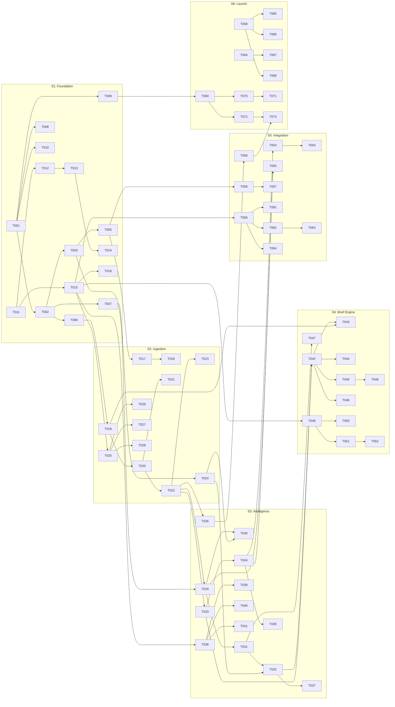

# Genio Knowledge OS — Stream MVP
## Implementation Plan v2.1 Optimized
**Version:** 2.1  
**Date:** February 2026  
**Timeline:** 12 Weeks (60 working days) — Backend + Frontend in Parallel  
**Optimizations Applied:** B03, B04, B05, B06, B07, B08, B11, B13, B14

> [!NOTE]
> This document defines **tasks and dependencies only**. Architecture → `GENIO_PRD_UNIFIED.md`. Scope/criteria → `GENIO_MVP_UNIFIED.md`.

---

## 1. System Architecture

```
                    ┌─────────────────────────────┐
                    │   React 18 SPA (TypeScript)  │
                    │   TanStack Query, React Router│
                    └──────────────┬──────────────┘
                                   │ HTTPS/JSON
                                   ▼
                  ┌──────────────────────────────────┐
                  │   FastAPI (Python 3.12)           │
                  │   JWT Auth │ Rate Limit │ CORS    │
                  └─────────┬────────────┬───────────┘
                            │            │
              ┌─────────────▼──┐   ┌─────▼──────────┐
              │ Celery Workers  │   │  Data Stores    │
              │ + Celery Beat   │   │                 │
              │ (Redis broker)  │   │ PostgreSQL 15   │
              │                 │   │ Qdrant (vector) │
              └────────┬────────┘   │ Redis 7 (cache  │
                       │            │  + broker)      │
                       ▼            └─────────────────┘
              ┌─────────────────┐
              │ External APIs    │
              │ OpenAI, Gemini   │
              │ SendGrid         │
              └─────────────────┘
```

### Article Processing Pipeline (B06: FSM-Based)

```
           ┌──────────────────────────────────────────────────────┐
           │             Article Processing FSM                    │
           │                                                       │
FETCHED ──► EXTRACTING ──► EMBEDDING ──► SCORING ──► SUMMARIZING ──► READY
           │       │            │           │            │          │
           │       ▼            ▼           ▼            ▼          │
           │    EXTRACT_     EMBED_     SCORE_      SUMMARIZE_     │
           │    FAILED      FAILED     FAILED      FAILED          │
           │                                                       │
           │  SWEEPER: retries any article stuck >5min in any      │
           │  intermediate state (max 3 retries, then → FAILED)    │
           └──────────────────────────────────────────────────────┘
```

---

## 2. Technology Stack

| Component | Technology | Notes |
|-----------|------------|-------|
| Backend | Python 3.12, FastAPI 0.109+ | |
| ORM | SQLModel 0.0.14+ | |
| Task Queue | Celery 5.3+ | |
| Broker | **Redis 7** | Cache + broker combined (B11) |
| Relational DB | PostgreSQL 15+ | |
| Vector DB | Qdrant 1.7+ | 1536-dim HNSW index |
| AI Gateway | LiteLLM | |
| Embedding | text-embedding-3-small | **1536-dim** (B01) |
| Frontend | React 18 + TypeScript | |
| Data Fetching | TanStack Query 5+ | |
| Email | SendGrid | |
| Monitoring | Datadog | |
| Container | Docker + ECS Fargate | |

---

## 3. Sprint Breakdown (Parallelized — B14 Applied)

> [!IMPORTANT]
> Backend (BE) and Frontend (FE) tracks run in parallel from Sprint 1. An OpenAPI specification is defined in S1 to enable FE development with mock data while BE builds real endpoints.

### Sprint 1: Foundation (Weeks 1-2)

#### BE Track

| ID | Task | Hours | Deliverable | Done When |
|----|------|-------|-------------|-----------|
| T001 | Monorepo scaffold (poetry, pyproject.toml) | 2h | `/backend` structure | `poetry install` succeeds |
| T002 | Docker Compose (FastAPI, Postgres, Redis, Qdrant) | 3h | `docker-compose.yml` | `docker compose up` → all 4 healthy |
| T003 | PostgreSQL schema migration v1 (users, feeds, articles, user_article_context) | 4h | Alembic migration | `alembic upgrade head` passes |
| T004 | FastAPI app skeleton + health endpoint | 2h | `/health` returns 200 | curl test passes |
| T005 | JWT auth module (register, login, refresh, Google OAuth stub) | 4h | `/auth/*` endpoints | Auth flow test passes |
| T006 | Redis connection pool + cache helper | 2h | `RedisClient` singleton | ping + get/set test |
| T007 | Qdrant collection initialization (1536-dim, HNSW, cosine) | 2h | Collection created | Qdrant dashboard shows collection |
| T008 | OpenAPI spec v1 (all endpoints, request/response schemas) | 3h | `openapi.yaml` | Validates with Swagger Editor |
| T009 | CI pipeline (lint, type-check, test, build) | 3h | GitHub Actions | CI green on commit |
| T010 | Environment config (pydantic-settings, .env.example) | 2h | Settings class | Tests load all required vars |

#### FE Track

| ID | Task | Hours | Deliverable | Done When |
|----|------|-------|-------------|-----------|
| T011 | Vite + React 18 + TypeScript scaffold | 2h | `/frontend` structure | `npm run dev` serves |
| T012 | Design system foundation (tokens, colors, typography) | 4h | CSS variables + base components | Storybook/demo renders |
| T013 | Layout shell (sidebar, header, content area) | 3h | `<AppLayout />` | Responsive at 1024/768/375 |
| T014 | Auth pages (Login, Register) with mock API | 3h | Login + Register screens | Form submission → mock JWT stored |
| T015 | TanStack Query setup + API client from OpenAPI spec | 3h | Generated API types + hooks | `useQuery` works with mock server |
| T016 | Route structure (React Router v6) | 2h | Protected routes | Redirect to /login when unauthenticated |

---

### Sprint 2: Ingestion + Feed Shell (Weeks 3-4)

#### BE Track

| ID | Task | Hours | Deliverable | Done When | Depends |
|----|------|-------|-------------|-----------|---------|
| T017 | Feed CRUD endpoints (add, edit, delete, list) | 4h | `/feeds/*` | CRUD test passes | T005 |
| T018 | OPML parser + import endpoint | 3h | `/feeds/import` | 200-feed OPML imports in <30s | T017 |
| T019 | Celery worker setup + Redis broker config | 3h | Worker process | `celery worker` starts, picks up test task | T006 |
| T020 | Feed fetcher task (feedparser, HTTP client, adaptive interval) | 4h | `fetch_feed` task | Fetches 10 real feeds | T019 |
| T021 | Adaptive scheduling engine (B03) | 3h | `compute_fetch_interval()` | Interval adjusts based on avg_update_interval | T020 |
| T022 | Content extraction pipeline (Readability, text cleaning) | 4h | `extract_content` task | Extracts 100 articles clean | T020 |
| T023 | Article deduplication (URL + content_hash check) | 2h | Global dedup logic | Duplicate URL → skipped | T022 |
| T024 | shared article pool schema + insert logic (B04) | 3h | `articles` + `user_article_context` tables | Insert + join test | T003 |

#### FE Track

| ID | Task | Hours | Deliverable | Done When | Depends |
|----|------|-------|-------------|-----------|---------|
| T025 | Feed Manager page (list, add modal, delete) | 4h | Feed management UI | Add/delete feed w/ mock data | T015 |
| T026 | OPML import UI (drag-drop, progress indicator) | 3h | Import flow | File upload → progress bar → feed list updates | T025 |
| T027 | Category/folder sidebar for feeds | 3h | Category tree | Feeds grouped by category | T025 |
| T028 | Feed status indicators (active, error, disabled) | 2h | Status badges | Visual indicators per feed | T025 |

---

### Sprint 3: Intelligence + Feed UI (Weeks 5-6)

#### BE Track

| ID | Task | Hours | Deliverable | Done When | Depends |
|----|------|-------|-------------|-----------|---------|
| T029 | Batch embedding generation (B13) | 4h | `generate_embeddings_batch` | 50 articles → 1 API call → 50 vectors stored | T022, T007 |
| T030 | Embedding reuse for shared articles (B04) | 2h | Skip if `embedding_vector_id` exists | No duplicate embedding calls | T029, T024 |
| T031 | Knowledge Delta algorithm (k=10, 3-tier classification) | 4h | `compute_delta` function | DUPLICATE/RELATED/NOVEL classification | T029 |
| T032 | Per-user novelty scoring | 3h | `score_user_novelty` | delta_score per user_article_context row | T031, T024 |
| T033 | Article summary generation (Gemini Flash via LiteLLM) | 4h | `generate_summary` task | Summary stored in articles.global_summary | T022 |
| T034 | LiteLLM setup + cost tracking middleware | 3h | Model config + per-call logging | Cost logged per API call | T033 |
| T035 | Circuit breaker module (B05) | 3h | `CircuitBreaker` class | CLOSED→OPEN after 5 failures, HALF_OPEN after 60s | T034 |
| T036 | FSM processing status + sweeper task (B06) | 4h | `processing_status` enum + sweeper | Stuck articles retried; FAILED after 3 attempts | T022 |
| T037 | Article listing endpoint (paginated, sorted by delta_score) | 3h | `/articles` | 20/page, delta_score DESC | T032 |

#### FE Track

| ID | Task | Hours | Deliverable | Done When | Depends |
|----|------|-------|-------------|-----------|---------|
| T038 | Article feed view (card list, delta score badge) | 4h | Feed reader UI | Articles show w/ mock data | T015 |
| T039 | Article detail view (full content, reading progress) | 3h | Article reader | Full content renders | T038 |
| T040 | Search + filter bar (by source, date, delta score) | 3h | Filter component | Filters update article list | T038 |
| T041 | Reading status tracking (read/unread/archived) | 2h | Status toggle | Click → mark read | T038 |

---

### Sprint 4: Brief Engine + Brief UI (Weeks 7-8)

#### BE Track

| ID | Task | Hours | Deliverable | Done When | Depends |
|----|------|-------|-------------|-----------|---------|
| T042 | Brief generation orchestrator | 4h | `generate_brief` task | Top 15 articles → structured brief | T032, T033 |
| T043 | Staggered scheduling (B07: user_id % 60) | 3h | `schedule_briefs` | Load evenly spread within hour | T042, T019 |
| T044 | "Quiet Day" detection (<3 novel articles → skip AI) | 2h | Conditional logic | No AI call for quiet days | T042 |
| T045 | Email delivery via SendGrid | 3h | `deliver_brief_email` | Email received in inbox | T042 |
| T046 | Brief CRUD endpoints (list, get, archive) | 3h | `/briefs/*` | Brief retrieval test passes | T042 |
| T047 | "The Diff" section computation | 3h | Unique info per source | Diff section populated in brief | T031 |
| T048 | Brief delivery tracking (sent/delivered/opened) | 2h | Webhook handler | SendGrid events logged | T045 |

#### FE Track

| ID | Task | Hours | Deliverable | Done When | Depends |
|----|------|-------|-------------|-----------|---------|
| T049 | Daily Brief reader (structured layout) | 4h | Brief UI | Renders executive summary + key stories + Diff | T015 |
| T050 | Brief history list (chronological) | 2h | Brief archive | Past briefs browsable | T049 |
| T051 | Brief preferences (time, timezone, frequency) | 3h | Settings form | Preferences saved | T049 |
| T052 | Email preview / toggle | 2h | Email pref | Enable/disable email delivery | T051 |

---

### Sprint 5: Integration + Budget (Weeks 9-10)

#### BE Track

| ID | Task | Hours | Deliverable | Done When | Depends |
|----|------|-------|-------------|-----------|---------|
| T053 | AI budget tracker (per-user, daily/monthly rollup) | 4h | Budget accounting | Cost tracked per AI call and per user | T034 |
| T054 | Graceful degradation engine (B12: L1→L2→L3) | 4h | `DegradationManager` | Behavior changes at 50%/20% thresholds | T053 |
| T055 | Intelligent router (B02: vector-based intent routing) | 4h | `IntelligentRouter` | Routes to correct model tier | T034, T029 |
| T056 | User settings CRUD (timezone, brief prefs, categories) | 3h | `/user/settings` | Settings persist | T005 |
| T057 | Stripe integration (checkout, webhook, subscription mgmt) | 4h | `/billing/*` | Test checkout completes | T056 |
| T058 | API integration tests (full E2E: feed→article→brief) | 4h | Test suite | E2E test passes | All BE tasks |
| T059 | Observability setup (B08: 5 SLIs + alerting) | 3h | Datadog dashboards | 5 SLIs visible + alerts configured | T036 |

#### FE Track

| ID | Task | Hours | Deliverable | Done When | Depends |
|----|------|-------|-------------|-----------|---------|
| T060 | Connect all pages to real API (replace mock data) | 4h | Full integration | All pages show real data | T015, BE endpoints |
| T061 | AI budget dashboard (usage bar, degradation level indicator) | 3h | Budget UI | Shows current usage + level | T060 |
| T062 | Settings page (profile, preferences, billing) | 3h | Settings UI | All settings editable | T060 |
| T063 | Stripe checkout flow (plan selection, payment) | 3h | Billing UI | Upgrade flow completes | T062 |
| T064 | Error handling + loading states + empty states | 3h | UX polish | All API errors handled gracefully | T060 |

---

### Sprint 6: Testing + Launch (Weeks 11-12)

| ID | Task | Hours | Deliverable | Done When | Depends |
|----|------|-------|-------------|-----------|---------|
| T065 | Load testing (k6: 1000 concurrent, 500 feeds) | 4h | Load test report | p95 <200ms, 0 errors | T058 |
| T066 | Security scan (OWASP ZAP, dependency audit) | 3h | Security report | No critical/high vulnerabilities | T058 |
| T067 | API rate limiting + abuse prevention | 3h | Rate limiter | 429 returned at threshold | T004 |
| T068 | Database indexing audit | 2h | Index additions | All slow queries <50ms | T058 |
| T069 | Staging deployment (AWS ECS Fargate) | 4h | Staging env | Full stack running on AWS | T009 |
| T070 | Beta user onboarding (10-20 users) | 3h | Beta program | Users actively using product | T069 |
| T071 | Feedback collection + bug fixes | 4h | Bug fix PRs | Critical bugs resolved | T070 |
| T072 | Production deployment + DNS + SSL | 3h | Prod env | genio.ai live | T069 |
| T073 | Monitoring verification (all 5 SLIs green) | 2h | Dashboard check | All alerts silent | T059, T072 |
| T074 | Launch checklist sign-off | 2h | Checklist doc | All gates passed | All tasks |

---

## 4. Dependency Graph



---

## 5. Milestone Verification Checklists

### M1: Foundation (Week 2)

| Check | Command/Method | Pass |
|-------|----------------|------|
| Docker Compose healthy | `docker compose ps` → all services "healthy" | ☐ |
| PostgreSQL schema | `alembic upgrade head` → 0 errors | ☐ |
| Qdrant collection | `curl qdrant:6333/collections` → collection exists | ☐ |
| Redis connected | `redis-cli ping` → PONG | ☐ |
| Health endpoint | `curl /health` → 200 | ☐ |
| CI green | GitHub Actions → all checks pass | ☐ |
| Auth flow | Register + Login → JWT returned | ☐ |
| OpenAPI spec | Swagger Editor validates | ☐ |
| FE serves | `npm run dev` → localhost renders | ☐ |
| FE auth mock | Login form → mock JWT stored | ☐ |

### M2: Ingestion Pipeline (Week 4)

| Check | Command/Method | Pass |
|-------|----------------|------|
| 100 feeds fetched | DB query → `count(feeds) >= 100` | ☐ |
| Content extracted | `count(articles WHERE status='extracted') > 500` | ☐ |
| Adaptive intervals | Feed with slow updates → interval=60min | ☐ |
| Dedup working | Duplicate URL → rejected | ☐ |
| Shared pool | Same article from 2 feeds → 1 row in articles | ☐ |
| OPML import | 200-feed file → <30s | ☐ |
| FE feed manager | Add/delete/categorize feeds in UI | ☐ |

### M3: Intelligence (Week 6)

| Check | Command/Method | Pass |
|-------|----------------|------|
| Batch embeddings | 50 articles → 1 API call | ☐ |
| 1536-dim vectors | Qdrant collection → dim=1536 | ☐ |
| Delta scores | `count(articles WHERE delta_score IS NOT NULL) > 1000` | ☐ |
| DUPLICATE filtered | Score ≥0.90 → not in user feed | ☐ |
| Summaries generated | `count(articles WHERE global_summary IS NOT NULL) > 500` | ☐ |
| Circuit breaker | Mock API failure → breaker opens after 5 fails | ☐ |
| Sweeper working | Stuck article → retried within 5 min | ☐ |
| FE article view | Articles render with delta badges | ☐ |

### M4: Brief Engine (Week 8)

| Check | Command/Method | Pass |
|-------|----------------|------|
| Brief generated | At least 1 brief with sections | ☐ |
| Staggered delivery | Briefs spread within hour (not all at :00) | ☐ |
| Quiet day | <3 articles → "Quiet Day" (no AI call) | ☐ |
| Email sent | SendGrid → delivered to inbox | ☐ |
| The Diff | Unique info section populated | ☐ |
| FE brief reader | Brief renders in UI | ☐ |

### M5: Integration (Week 10)

| Check | Command/Method | Pass |
|-------|----------------|------|
| Full E2E | Add feed → articles appear → brief generated | ☐ |
| Budget tracking | AI calls → budget decremented | ☐ |
| L1→L2→L3 | Budget 50% → L2 behavior; 20% → L3 behavior | ☐ |
| Stripe checkout | Test card → subscription active | ☐ |
| Settings persist | Change timezone → reflected in brief schedule | ☐ |
| SLIs visible | 5 Datadog dashboards with data | ☐ |
| FE real data | All pages show real API data | ☐ |

### M6: Launch (Week 12)

| Check | Command/Method | Pass |
|-------|----------------|------|
| Load test | 1000 concurrent → p95 <200ms | ☐ |
| Security scan | OWASP ZAP → 0 critical/high | ☐ |
| Staging stable | 48h run → 0 unplanned restarts | ☐ |
| Beta feedback | ≥10 users, critical bugs fixed | ☐ |
| Production live | genio.ai responds, SSL valid | ☐ |
| Monitoring green | All 5 SLIs within threshold | ☐ |
| Stripe live | Real payment succeeds | ☐ |

---

## 6. Observability Contract (B08)

| SLI | Target | Alert Threshold | Dashboard |
|-----|--------|-----------------|-----------|
| Feed fetch success rate | >98% | <95% for 15min | Feed Health |
| Extraction success rate | >95% | <90% for 15min | Pipeline |
| Embedding generation p95 | <2s | >5s for 5min | AI Performance |
| Brief delivery success rate | >99% | <95% for any batch | Brief Delivery |
| AI budget utilization | <80% of pool | >90% of pool | Cost Mgmt |

---

## 7. Risk Registry

| Risk | P | I | Mitigation | Contingency |
|------|---|---|------------|-------------|
| OpenAI API outage | M | H | Circuit breaker (B05) + model fallback | Excerpt mode (L3) |
| Embedding cost overrun | M | H | 1536-dim (B01) + batch (B13) + shared pool (B04) | Reduce k, lengthen fetch interval |
| Brief thundering herd | H | H | Staggered scheduling (B07) | Rate limit to 50 concurrent |
| Feed parsing failure | M | M | Multiple parsers + auto-disable | Manual feed review |
| Frontend integration delay | H | H | Parallelized (B14) + API contract first | Feature flag partial launch |
| Redis broker data loss | L | M | `task_acks_late=True` + sweeper (B06) | RabbitMQ upgrade at >10k users |
| Scope creep | H | H | Strict in/out-of-scope in MVP doc | Defer to v1.5 |
| Team capacity | M | H | Atomic tasks (2-4h), clear dependencies | Prioritize P0 features, defer P1/P2 |

---

## 8. Team & Cost Estimate

### Team Composition (Minimum Viable)

| Role | Count | Focus |
|------|-------|-------|
| Backend Engineer | 1-2 | API + Pipeline + AI integration |
| Frontend Engineer | 1 | React SPA (parallel from S1) |
| DevOps/Infra | 0.5 | Docker, AWS, CI/CD |
| Product/Design | 0.5 | UX, acceptance testing |

### Monthly Infrastructure Cost (MVP — 1000 Users)

| Service | Spec | Cost/Month |
|---------|------|------------|
| ECS Fargate (API + Workers) | 2 vCPU, 4 GB × 2 | $120 |
| PostgreSQL (RDS) | db.t3.medium | $65 |
| Redis (ElastiCache) | cache.t3.micro | $15 |
| Qdrant (self-hosted on EC2) | t3.medium | $30 |
| OpenAI API (embeddings + summaries) | ~$0.08 + $1.30/user | $1,380 |
| Google Gemini API (Flash) | ~$0.30/user | $300 |
| SendGrid | Essentials plan | $20 |
| Datadog | Infrastructure plan | $50 |
| **Total** | | **~$1,980** |
| **Per User** | | **$1.98** |

---

*Implementation Plan v2.1. SSOT for tasks and dependencies. Architecture → PRD. Scope/criteria → MVP.*
