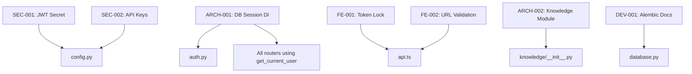

# Genio Codebase Audit - Detailed Analysis and Fix Plan

**Date:** February 18, 2026  
**Target:** genio-mvp (Backend/Frontend)  
**Status:** CRITICAL ISSUES FOUND

---

## 1. Executive Summary

| Category | Status | Risk Level | Key Findings |
|----------|--------|------------|--------------|
| Security | ⛔ Critical | High | Hardcoded JWT secret; default values for secrets |
| Architecture | ⚠️ Warning | Medium | Manual DB session bypassing DI; empty knowledge module |
| Frontend | ⚠️ Warning | Medium | Auth token refresh race condition; hardcoded URL fallback |
| DevOps | ✅ Partial | Low | Alembic configured but init_db uses create_all |

---

## 2. Detailed Issue Analysis

### 2.1 Security Violations (CRITICAL - P0)

#### Issue SEC-001: Hardcoded JWT Secret Key
**File:** [`backend/app/core/config.py:36`](genio-mvp/backend/app/core/config.py:36)
**Severity:** CRITICAL
**Impact:** System is trivially hackable if deployed without setting env vars

**Current Code:**
```python
JWT_SECRET_KEY: str = "your-secret-key-change-in-production"
```

**Root Cause:** Default value provided for required security setting
**Fix Strategy:** 
1. Remove default value
2. Make field required in production
3. Add validation to fail fast if not set

---

#### Issue SEC-002: Empty String Defaults for API Keys
**File:** [`backend/app/core/config.py:27-29,32,47-49`](genio-mvp/backend/app/core/config.py:27)
**Severity:** HIGH
**Impact:** Developers might accidentally commit actual values; unclear what's required

**Current Code:**
```python
OPENAI_API_KEY: str = ""
GEMINI_API_KEY: str = ""
SENDGRID_API_KEY: str = ""
STRIPE_SECRET_KEY: str = ""
```

**Root Cause:** Using empty strings instead of Optional types
**Fix Strategy:**
1. Change to `Optional[str] = None`
2. Add validation for required keys at startup
3. Document which keys are required vs optional

---

### 2.2 Architectural Issues (P0/P1)

#### Issue ARCH-001: Manual DB Session Management (Anti-Pattern)
**File:** [`backend/app/core/auth.py:121-136`](genio-mvp/backend/app/core/auth.py:121)
**Severity:** HIGH
**Impact:** Connection leaks; inconsistent transaction management; difficult testing

**Current Code:**
```python
async def get_current_user(
    credentials: HTTPAuthorizationCredentials = Depends(security),
) -> "User":
    # ...
    db = SessionLocal()  # <--- CRITICAL ANTI-PATTERN
    try:
        user = db.query(User).filter(User.id == token_data.user_id).first()
        # ...
    finally:
        db.close()
```

**Root Cause:** Bypassing FastAPI's dependency injection system
**Fix Strategy:**
1. Refactor to accept `db: Session = Depends(get_session)`
2. Update all callers to inject the session
3. Remove manual SessionLocal() usage

**Dependencies:** This fix affects all routes using `get_current_user`

---

#### Issue ARCH-002: Empty Knowledge Module
**File:** [`backend/app/knowledge/__init__.py`](genio-mvp/backend/app/knowledge/__init__.py)
**Severity:** MEDIUM
**Impact:** Core logic appears missing or misplaced

**Current Code:**
```python
# Knowledge management package
```

**Root Cause:** Logic implemented elsewhere (in `library/` module)
**Fix Strategy:**
1. Document that knowledge logic is in `library/` module
2. Add re-exports for backward compatibility
3. OR populate with core knowledge functions

---

### 2.3 Frontend Issues (P0)

#### Issue FE-001: Auth Token Refresh Race Condition
**File:** [`frontend/src/services/api.ts:52-67`](genio-mvp/frontend/src/services/api.ts:52)
**Severity:** HIGH
**Impact:** Multiple simultaneous 401s cause multiple refresh attempts; first refresh invalidates others

**Current Code:**
```typescript
if (response.status === 401) {
    const refreshed = await this.refreshToken();  // No locking!
    if (refreshed) {
        // Retry...
    }
}
```

**Root Cause:** No synchronization between concurrent refresh attempts
**Fix Strategy:**
1. Implement "refresh promise lock" pattern
2. Store pending refresh promise
3. All concurrent requests await same promise

---

#### Issue FE-002: Hardcoded URL Fallback
**File:** [`frontend/src/services/api.ts:6`](genio-mvp/frontend/src/services/api.ts:6)
**Severity:** MEDIUM
**Impact:** Production builds may connect to localhost if env var missed

**Current Code:**
```typescript
const API_BASE_URL = import.meta.env.VITE_API_URL || 'http://localhost:8000';
```

**Root Cause:** Silent fallback instead of fail-fast
**Fix Strategy:**
1. Throw error in production if VITE_API_URL not set
2. Keep fallback only for development mode

---

### 2.4 DevOps & Database (P0 - Partially Fixed)

#### Issue DEV-001: init_db Uses create_all Instead of Alembic
**File:** [`backend/app/core/database.py:26-50`](genio-mvp/backend/app/core/database.py:26)
**Severity:** MEDIUM
**Impact:** Schema changes require dropping database

**Current Code:**
```python
def init_db():
    SQLModel.metadata.create_all(engine)
```

**Good News:** Alembic IS properly configured with migrations in [`backend/alembic/versions/001_initial_schema.py`](genio-mvp/backend/alembic/versions/001_initial_schema.py)

**Fix Strategy:**
1. Update `init_db()` to use Alembic or document Alembic as preferred method
2. Add comment explaining when to use each approach

---

## 3. Fix Implementation Plan

### Phase 1: Critical Security Fixes (P0)

| Issue | File | Fix Description |
|-------|------|-----------------|
| SEC-001 | config.py | Remove default JWT secret; add validation |
| SEC-002 | config.py | Change to Optional types; add startup validation |
| ARCH-001 | auth.py | Refactor to use DI for DB session |
| FE-001 | api.ts | Implement refresh token locking |

### Phase 2: Medium Priority Fixes (P1)

| Issue | File | Fix Description |
|-------|------|-----------------|
| ARCH-002 | knowledge/__init__.py | Add module documentation and re-exports |
| FE-002 | api.ts | Add production build validation |
| DEV-001 | database.py | Document Alembic usage |

---

## 4. Verification Tests

### SEC-001/SEC-002 Verification
```python
# test_config_validation.py
def test_jwt_secret_required_in_production():
    """Verify JWT_SECRET_KEY is required when DEBUG=False"""
    import os
    os.environ.pop('JWT_SECRET_KEY', None)
    os.environ['DEBUG'] = 'false'
    
    with pytest.raises(ValueError):
        from app.core.config import Settings
        Settings()
```

### ARCH-001 Verification
```python
# test_auth_di.py
def test_get_current_user_uses_di():
    """Verify get_current_user accepts injected session"""
    from app.core.auth import get_current_user
    import inspect
    sig = inspect.signature(get_current_user)
    params = list(sig.parameters.values())
    
    # Should have db parameter with Depends
    assert any('db' in str(p) or 'session' in str(p) for p in params)
```

### FE-001 Verification
```typescript
// test_token_refresh_lock.ts
describe('Token Refresh Lock', () => {
    it('should only refresh once for concurrent 401s', async () => {
        const api = new ApiClient('http://test');
        const refreshSpy = jest.spyOn(api, 'refreshToken');
        
        // Simulate 5 concurrent 401 responses
        const promises = Array(5).fill(null).map(() => 
            api.request('/test')
        );
        
        await Promise.allSettled(promises);
        expect(refreshSpy).toHaveBeenCalledTimes(1);
    });
});
```

---

## 5. Dependency Graph



---

## 6. Risk Assessment

| Fix | Regression Risk | Testing Required |
|-----|-----------------|------------------|
| SEC-001 | Low | Unit tests for config validation |
| SEC-002 | Low | Unit tests for config validation |
| ARCH-001 | **HIGH** | Full auth flow E2E tests |
| FE-001 | Medium | Token refresh unit tests |
| FE-002 | Low | Build verification |
| ARCH-002 | Low | Import tests |
| DEV-001 | Low | Documentation review |

---

## 7. Rollback Plan

If any fix causes issues:

1. **SEC-001/SEC-002:** Revert config.py changes; environment variables still work
2. **ARCH-001:** Keep original `get_current_user` as `get_current_user_legacy` temporarily
3. **FE-001:** Feature flag for new locking behavior
4. **All fixes:** Git revert to pre-fix commit

---

## 8. Next Steps

1. Switch to Code mode to implement fixes
2. Start with P0 security issues (SEC-001, SEC-002)
3. Then fix ARCH-001 (auth DI)
4. Then fix FE-001 (token locking)
5. Run verification tests
6. Update documentation

---

*Generated by GenioCortex Analysis*
